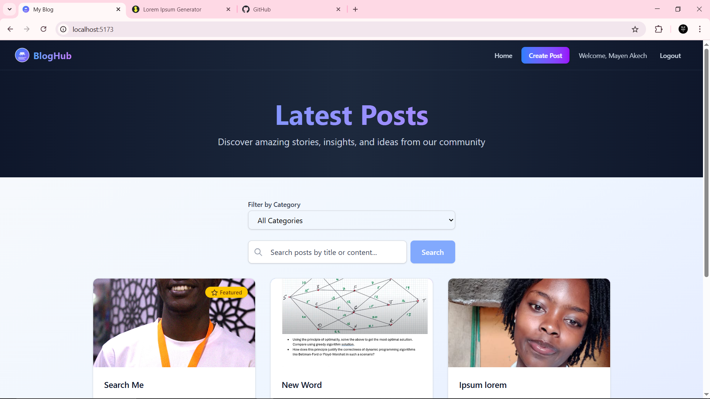
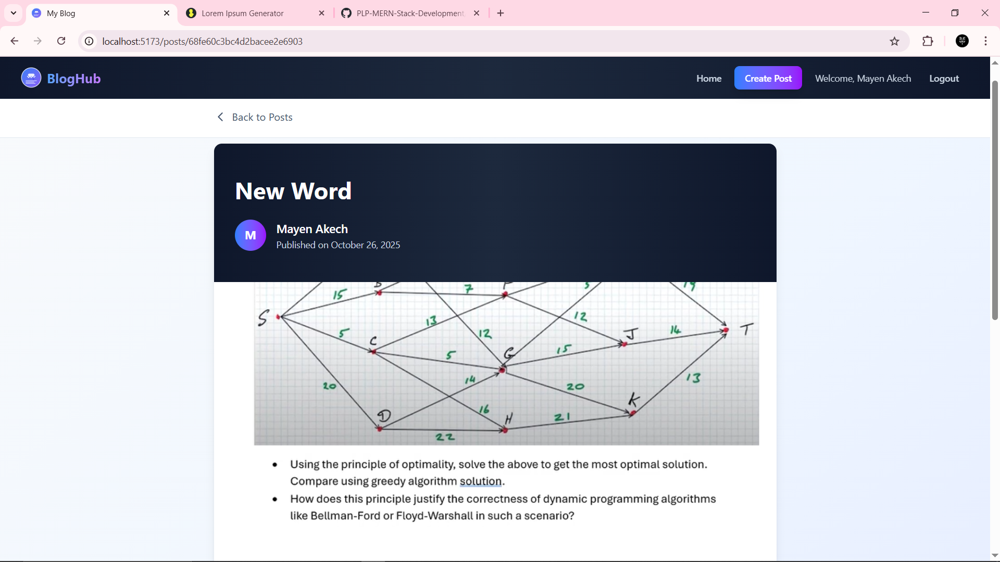
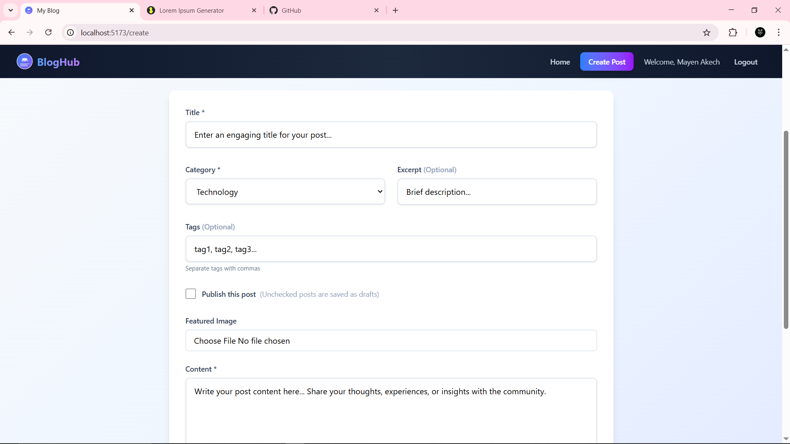

# MERN Blog Application

A full-stack blog application built with the MERN stack (MongoDB, Express.js, React.js, Node.js) featuring user authentication, content management, and interactive commenting system.

## 🚀 Features

### Core Functionality

- **User Authentication**: JWT-based registration and login
- **Blog Post Management**: Full CRUD operations for blog posts
- **Category Management**: Organize posts by categories
- **Rich Content**: Support for featured images, excerpts, and tags
- **Publishing System**: Draft and published post states

### Advanced Features

- **Interactive Comments**: Users can comment on blog posts
- **Search & Filter**: Search posts by content and filter by category
- **Pagination**: Efficient loading of large post collections
- **Image Uploads**: Featured image support with file upload
- **Responsive Design**: Mobile-friendly UI with Tailwind CSS
- **Protected Routes**: Authentication-based access control

## 🛠️ Tech Stack

### Frontend

- **React 19** - Modern React with hooks
- **React Router** - Client-side routing
- **Tailwind CSS** - Utility-first CSS framework
- **Axios** - HTTP client for API calls
- **Vite** - Fast build tool and dev server

### Backend

- **Node.js** - JavaScript runtime
- **Express.js** - Web framework
- **MongoDB** - NoSQL database
- **Mongoose** - ODM for MongoDB
- **JWT** - Authentication tokens
- **Multer** - File upload middleware
- **bcrypt** - Password hashing

## 📁 Project Structure

```
mern-blog/
├── client/                 # React frontend
│   ├── public/            # Static assets
│   ├── src/
│   │   ├── components/    # Reusable React components
│   │   ├── context/       # React Context providers
│   │   ├── services/      # API service functions
│   │   └── App.jsx        # Main app component
│   ├── .env.example       # Environment variables template
│   └── package.json
├── server/                 # Express backend
│   ├── models/            # Mongoose schemas
│   ├── routes/            # API endpoints
│   ├── middleware/        # Custom middleware
│   ├── config/            # Database configuration
│   ├── .env.example       # Environment variables template
│   └── server.js          # Main server file
├── screenshots/            # Application screenshots (see screenshots/README.md)
└── README.md
```

## 🚀 Getting Started

### Prerequisites

- Node.js (v18 or higher)
- MongoDB (local or MongoDB Atlas)
- npm or yarn

### Installation

1. **Clone the repository**

   ```bash
   git clone <repository-url>
   cd mern-blog
   ```

2. **Install server dependencies**

   ```bash
   cd server
   npm install
   ```

3. **Install client dependencies**

   ```bash
   cd ../client
   npm install
   ```

4. **Environment Setup**

   Copy the example environment files and configure them:

   **Server:**

   ```bash
   cd server
   cp .env.example .env
   # Edit .env with your MongoDB connection and JWT secret
   ```

   **Client:**

   ```bash
   cd ../client
   cp .env.example .env
   # Edit .env with your API URL (usually http://localhost:5000/api)
   ```

5. **Start MongoDB**
   Make sure MongoDB is running locally or update the connection string for MongoDB Atlas.

6. **Start the development servers**

   **Terminal 1 - Server:**

   ```bash
   cd server
   npm run dev
   ```

   **Terminal 2 - Client:**

   ```bash
   cd client
   npm run dev
   ```

7. **Access the application**
   - Frontend: https://mern-blog-5k7g.onrender.com/
   - Backend API: https://bloghub-a6mc.onrender.com

## 📖 Usage

### User Registration & Login

1. Visit the application and click "Register"
2. Create an account with name, email, and password
3. Login with your credentials
4. Access protected features like creating posts

### Creating Blog Posts

1. Login to your account
2. Click "Create Post" in the navigation
3. Fill in the post details:
   - Title and content (required)
   - Category selection
   - Excerpt and tags (optional)
   - Featured image upload
   - Publish status
4. Save as draft or publish immediately

### Managing Content

- **View Posts**: Browse all published posts on the homepage
- **Search**: Use the search bar to find posts by title or content
- **Filter**: Filter posts by category using the dropdown
- **Comments**: Leave comments on individual posts
- **Edit/Delete**: Authors can edit or delete their own posts

## 🔌 API Endpoints

### Authentication

- `POST /api/auth/register` - User registration
- `POST /api/auth/login` - User login

### Posts

- `GET /api/posts` - Get all posts (with pagination)
- `GET /api/posts/:id` - Get single post
- `POST /api/posts` - Create new post (authenticated)
- `PUT /api/posts/:id` - Update post (authenticated)
- `DELETE /api/posts/:id` - Delete post (authenticated)
- `GET /api/posts/:id/comments` - Get post comments
- `POST /api/posts/:id/comments` - Add comment (authenticated)

### Categories

- `GET /api/categories` - Get all categories
- `POST /api/categories` - Create category (authenticated)

## 🎨 UI/UX Features

- **Responsive Design**: Works on desktop, tablet, and mobile
- **Loading States**: Visual feedback during API calls
- **Error Handling**: User-friendly error messages
- **Form Validation**: Client-side validation with helpful messages
- **Optimistic Updates**: Immediate UI feedback for actions
- **Accessibility**: Proper ARIA labels and keyboard navigation

## 🔒 Security Features

- **JWT Authentication**: Secure token-based authentication
- **Password Hashing**: bcrypt for secure password storage
- **Input Validation**: Server-side validation with express-validator
- **Protected Routes**: Authentication-required access control
- **CORS Configuration**: Proper cross-origin resource sharing

## 📝 Development Notes

- The application uses modern React patterns with hooks and context
- API calls are abstracted into reusable service functions
- State management is handled through React Context
- The backend follows RESTful API conventions
- File uploads are handled with multer middleware

### 📸 Taking Screenshots

For assignment submission, take screenshots of your running application and save them in the `screenshots/` directory. See `screenshots/README.md` for detailed instructions on which screenshots to take and naming conventions.

**Quick screenshot checklist:**

- Homepage with post list
- Single post view with comments
- Create/edit post form
- Login and registration pages
- User dashboard (My Posts)
- Mobile responsive view
- Comments functionality

## 📸 Screenshots

### Homepage - Post List


_The main blog homepage showing all published posts with search and category filtering_

### Single Post View


_Individual blog post view with content, author info, and comments section_

### Create/Edit Post Form


_Form for creating new blog posts with rich content editing and image upload_

## 🤝 Contributing

This is a complete MERN stack implementation demonstrating:

- Full-stack JavaScript development
- Modern React patterns
- RESTful API design
- Database relationships with Mongoose
- Authentication and authorization
- File upload handling
- Responsive UI design

## 📄 License

This project is part of a learning assignment and is not licensed for commercial use.
